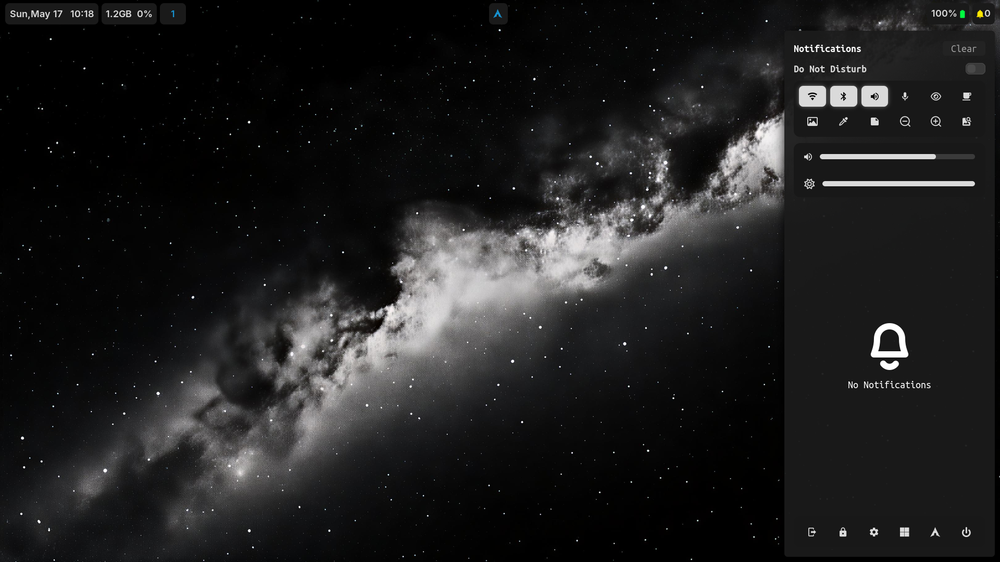
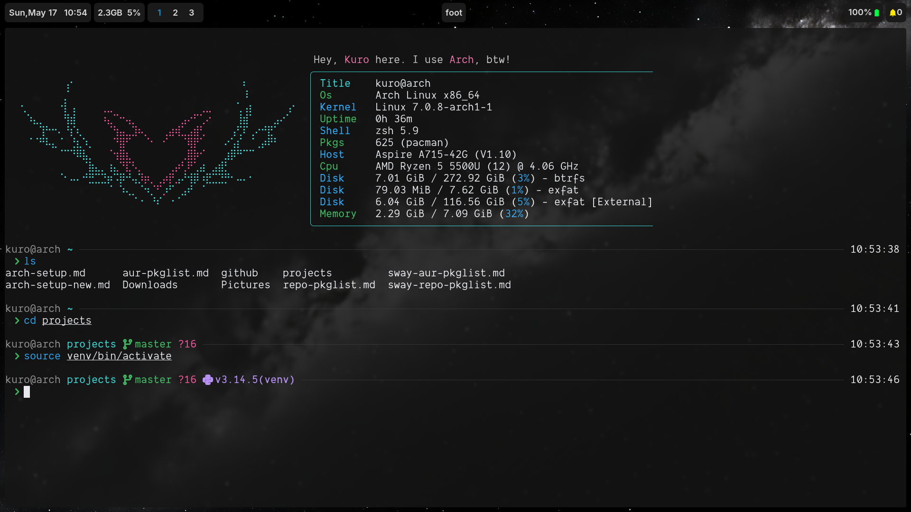
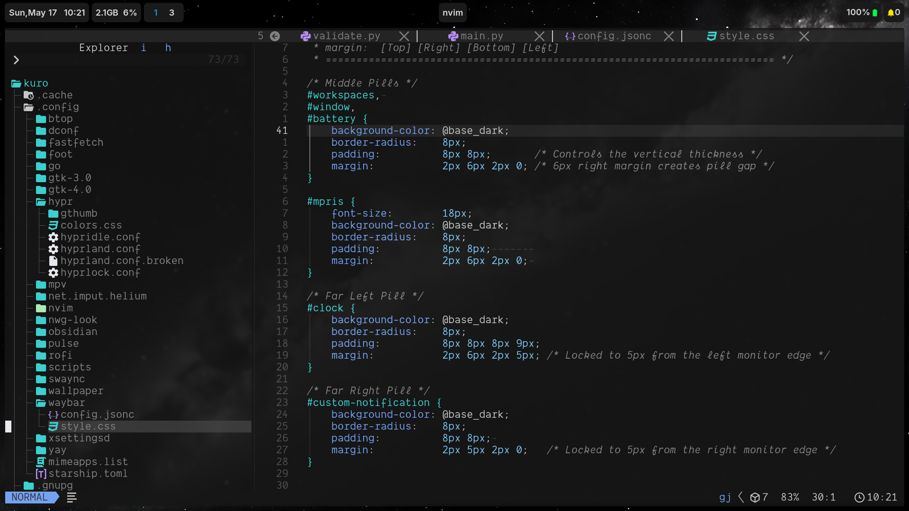

# dotfiles

Minimal, keyboard-driven Arch Linux setup running Hyprland on Wayland. Oxocarbon-inspired color scheme across the entire stack — terminal, editor, bar, and shell prompt. No bloat, no desktop environment.

---





---

## Stack

| Component      | Tool                             |
|----------------|----------------------------------|
| OS             | Arch Linux                       |
| Window Manager | Hyprland (Wayland, XWayland off) |
| Bar            | Waybar — minimal pill + mpris    |
| Terminal       | Foot                             |
| Shell          | Zsh + Starship                   |
| Editor         | Neovim (LazyVim)                 |
| Launcher       | Rofi                             |
| Notifications  | Swaync                           |
| File Manager   | Yazi                             |
| Wallpaper      | Awww                             |
| GTK Theme      | Orchis                           |
| Cursor         | Bibata Modern Classic            |
| Font           | Dank Mono Nerd Font              |
| Color Scheme   | Oxocarbon                        |

---

## Structure

```
home/
└── .config/
    ├── fastfetch/        # system info layout + custom logo
    ├── foot/             # terminal — Oxocarbon colors, Dank Mono
    ├── hypr/             # hyprland, hypridle, hyprlock
    ├── nvim/             # LazyVim — Oxocarbon theme
    ├── rofi/             # launcher
    ├── scripts/          # screenshot, kill-active, utilities
    ├── swaync/           # notification center + control panel
    ├── wallpaper/        # wallpapers
    ├── waybar/           # pill-style bar — clock, workspaces, battery, mpris
    ├── zsh/              # aliases, exports, plugins
    └── starship.toml     # prompt — git, python, node, docker, aws, k8s context
```

---

## Hyprland Highlights

- **XWayland disabled** — pure Wayland
- **Dwindle layout** with smart splits and preserved ratios
- **Blur + rounded corners** (5px), no borders, no shadows
- **Opacity** — 0.95 active / 0.87 inactive
- **VRR enabled** for variable refresh rate displays

### Keybindings

| Key                        | Action                       |
|----------------------------|------------------------------|
| `Super + A`                | Terminal (Foot)              |
| `Super + S`                | Editor (Neovim)              |
| `Super + D`                | Browser (Helium)             |
| `Super + W`                | Launcher (Rofi)              |
| `Super + Q`                | Close window                 |
| `Super + F`                | Fullscreen                   |
| `Super + C`                | Toggle float                 |
| `Super + Shift + L`                | Lock screen (Hyprlock)       |
| `Super + Esc`              | Power menu (Wlogout)         |
| `Super + Shift + S`        | Screenshot to clipboard      |
| `Super + Ctrl + Shift + S` | Screenshot to file           |
| `Print`                    | Full screenshot to file      |
| `Super + H / L`            | Switch workspace             |
| `Super + 1–0`              | Jump to workspace            |
| `Super + Arrow`            | Focus window                 |
| `Super + Shift + Arrow`    | Move window                  |
| `Super + Alt + Arrow`      | Resize window                |

---

## Waybar — Pill Design

Three floating pill groups anchored to the top bar:

- **Left** — clock · hardware group (CPU, RAM, disk) · workspaces
- **Center** — focused window title
- **Right** — MPRIS media · battery · notification toggle

---

## Reliability

- **Btrfs** with `@` and `@home` subvolumes — system rollbacks without touching user data
- **Timeshift** with `timeshift-autosnap` — automatic snapshot before every pacman upgrade
- **zram** swap (zstd, `ram / 2`) — effectively doubles usable memory
- **fstrim.timer** — weekly SSD TRIM for sustained write performance

---

## Fresh Install

> Want to reproduce this setup from scratch on a new machine?
> [`arch-install.md`](arch-install.md) is a complete step-by-step guide covering partitioning, Btrfs subvolumes, GRUB, Hyprland, Timeshift, and dotfile deployment directly from this repo — no USB needed beyond the Arch ISO.

---

## Just the Dotfiles

If you already have Arch running and just want the configs:

```bash
git clone https://github.com/Mayank-cs-2004/dotfiles.git /tmp/dotfiles
cp -r /tmp/dotfiles/home/. ~/
rm -rf /tmp/dotfiles
```

---

*I use Arch, btw.*
